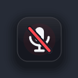
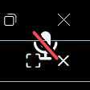
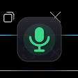

# iAlturki-MicMute

🎙️ A tiny, dependency-free microphone mute utility for Windows with a beautiful on-screen overlay and an event-driven audio engine.

[](https://github.com/iAlturki/MicMute/releases/latest/download/iAlturki-MicMute.exe)


| Muted | After 3 s | Unmute flash |
|:-:|:-:|:-:|
|  |  |  |

## What's new in 2.0

- Redesigned overlay: rounded badge, soft shadow, smooth animations, background melt + auto-dim
- Tray icons drawn at runtime — red badge when muted, theme-aware glyph with green dot when live
- Instant sync with mute changes from other apps (no polling) and mic hot-swap support
- Working custom hotkeys, synthesized audio cues, per-monitor DPI awareness

## Features

- **Visual overlay** – Per-pixel-alpha layered window rendered with GDI+: a rounded dark badge with a soft drop shadow and an antialiased mic glyph (red slash when muted). Fades and slides in on mute; after 3 seconds the badge background melts away leaving just the floating glyph, which settles to 70% opacity at the 6-second mark so it stays out of your way. Flashes a green "live" indicator that fades out on unmute. 9 screen positions, 4 sizes (16/32/64/96 px), per-monitor DPI-aware, with full multi-monitor and monitor hot-plug support.
- **Event-driven engine** – No polling. Reacts instantly when mute is changed by other apps (Teams, a keyboard mic key, Windows Settings), so the overlay and tray icon are always in sync.
- **Mic hot-swap support** – If the default microphone changes (unplug/replug, new device), the mute state carries over to the new device — privacy first.
- **Hotkey toggle** – F8 by default; choose F1–F12, Ctrl+M, or capture any custom key combination.
- **Runtime-rendered tray icon** – Red rounded badge with a severed mic when muted; theme-aware mic glyph (light/dark taskbar) with a green status dot when live. Tooltip shows the current state and hotkey. Double-click toggles, right-click opens the menu, and the icon survives Explorer restarts.
- **Audio feedback** – Pleasant synthesized two-tone cues: descending when muted, ascending when live.
- **Volume controls** – Optional mic volume lock (re-asserts a locked level) and optional system-volume ducking while muted.
- **Settings that stick** – Persisted in the registry (`HKCU\SOFTWARE\iAlturki\MicMute`) and validated on load; v1 settings carry over. Start-with-Windows toggle. Single instance — launching a second copy pings the running one.

## Installation

1. Download `iAlturki-MicMute.exe` from [Releases](../../releases)
2. Run it
3. Press F8 to mute/unmute your microphone

## Hotkey

The default hotkey is **F8**. To change it, right-click the tray icon and pick a hotkey from the menu — F1–F12, Ctrl+M, or **Set Custom…**, which opens a capture dialog where you simply press the combination you want.

## System Requirements

- Windows 10/11
- Single small executable, no dependencies
- Minimal CPU/RAM usage
- Runs elevated (one UAC prompt at launch) so the hotkey keeps working while
  admin apps or fullscreen games have focus; "Start with Windows" uses a
  Task Scheduler task with highest privileges

## Build from Source

Requires Visual Studio 2022. From a **VS2022 Developer Command Prompt** in the repository root:

```bat
mkdir build
rc /fo build\resources.res src\resources.rc
cl /O2 /W3 /Fe:build\iAlturki-MicMute.exe src\*.c build\resources.res user32.lib shell32.lib ole32.lib winmm.lib gdi32.lib advapi32.lib gdiplus.lib shcore.lib /link /SUBSYSTEM:WINDOWS /MANIFEST:NO
```

The result is a single `build\iAlturki-MicMute.exe`. Releases are also built automatically by GitHub Actions.

## License

MIT License - see [LICENSE](LICENSE) file.
